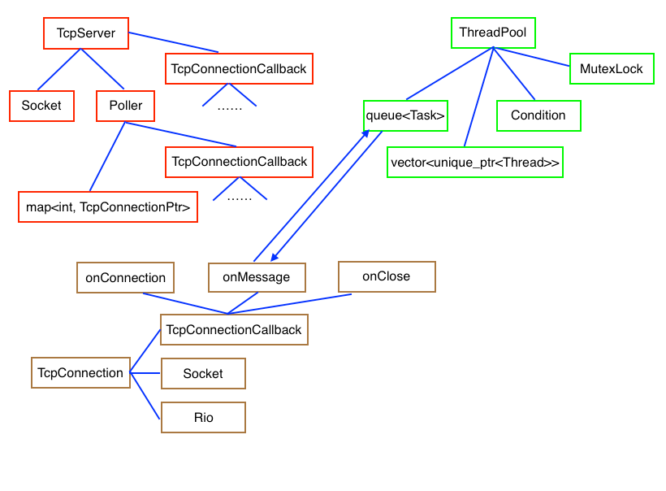

# Echo-Server

A lightweight non\-blocking network library in C++ on Linux.

---

## 1 简介

仿照 [muduo][1] (由陈硕先生编写)，主要用来学习 Linux 上的 C++ 网络编程。

-   采用 reactor 模式，由 poll 实现 non\-blocking 的 I/O。具体地，由一个 I/O 线程实现 event loop，而由多个计算线程实现时间处理与消息发送；
-   采用线程池，内含任务队列，线程容器，以及同步设施；
-   采用 std::shared\_ptr 来管理可拷贝对象，比如 TcpConnection 等；
-   采用 std::unique\_ptr 来管理不可拷贝对象，比如 Thread, Socket, Poller 等；
-   大量采用 callback 机制，尤其是 std::function 模板以及 std::bind 函数，实现基于对象的设计。比如将 TcpConnectionCallback (处理 TcpConnection 的函数，由用户提供) 从 TcpServer 注册到 Poller，再注册到 TcpConnection 中；
-   每个 TcpConnection 都有自己的 Rio buffer。

## 2 模块组织与工作流程

如上图所示：

1.  首先，由用户定义 onConnection, onMessage, onClose 三种事件处理函数。它们本身为关于 TcpConnectionPtr 的函数，这里使用了 std::bind 将其转变为了 TcpConnectionCallback 类型（也即 void()）的可调用对象。在构造 TcpServer 对象时，会将它们注册到其中，然后逐层注册到 Poller 以及 TcpConnection 中)。

    其中，

    -   onConnection 用以处理建立某条 Tcp 连接时发送给客户端的信息；
    -   onClose 用以处理断开某条 Tcp 连接时发送给客户端的信息；
    -   onMessage 用以处理客户端的请求，在处理完成后发送给客户端相应信息。具体地，会通过该 Tcp 连接接收客户端发来的信息，然后将计算任务 (Task 类型，见下面) 放入到 Task 队列里。线程从 Task 队列中取出某个任务后进行相应计算处理，最后再通过该 Tcp 连接发送信息给客户端。

    紧接着启动 TcpServer 和 ThreadPool。
2.  线程池在启动的时候会创建多个线程，其中每个线程所要执行的函数就是循环往复地从 Task 队列中取出 Task 并执行，这个函数是在创建线程的时候注册到每个线程中的。而每个 Task 本身是一个关于 TcpConnectionPtr 等类型的一个函数，这里使用了 std::bind 将其转变成了一个 void() 类型的可调用对象。
3.  TcpServer 中的 Poller 作为 event loop 运行。

    -   当客户端试图与这个服务端建立一个 Tcp 连接时，Poller 建立一个 TcpConnection，并由 std::shared\_ptr 管理。同时将得到的 fd 与这个 TcpConnectionPtr 构成的 pair 加入到 map 中。最后会调用该连接的 onConnection。
    -   当客户端发送请求给服务端时，Poller 会首先在 map 中找到 fd 对应的 TcpConnectionPtr，然后调用该连接的 onMessage。
    -   当客户端试图断开与这个服务器的 Tcp 连接时，Poller 会首先在 map 找到 fd 对应的 TcpConnectionPtr，然后调用该连接的 onClose。最后从 map 中删除这个 fd 与 TcpConnectionPtr 组成的 pair。

## 3 编译与安装

首先执行如下命令将项目下载到本地：

`git clone https://github.com/cuckootan/Echo-Server`

该项目提供了 **makefile** 文件，因此可以直接进行编译安装：

-   切换至 **Echo-Server** 目录，执行如下命令进行编译：

    `make`

    得到的动态库文件名为 **libecho.so**，存放在 **${PROJECT_DIR}/lib** 中。
-   然后执行如下命令进行安装：

    `sudo make install`

    会自动将动态库文件安装到 **/usr/local/lib** 中，所有头文件会安装到 **/usr/local/include** 中。

除此之外，还提供了通过 **cmake** 生成 makefile 文件的编译安装方式：

-   切换至 **Echo-Server** 目录，执行如下命令进行编译：

    `mkdir build && cd build`

    `cmake ..`

    `make`

    得到的动态库文件名为 **libecho.so**，存放在 **${PROJECT_DIR}/lib** 中。
-   然后执行如下命令进行安装：

    `sudo make install`

    会自动将动态库文件安装到 **/usr/local/lib** 中，所有头文件会安装到 **/usr/local/include** 中。

---

## Reference

-   Linux 多线程服务端编程：使用 muduo C++ 网络库。

  [1]: https://github.com/chenshuo/muduo
